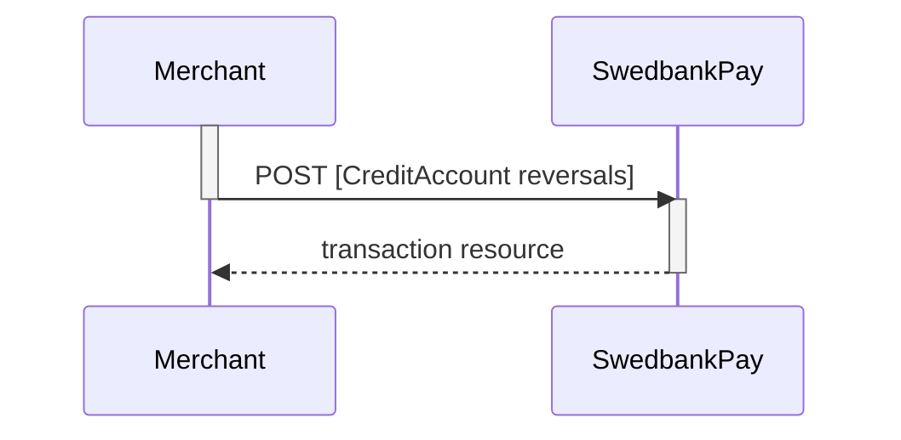



## Options after posting a payment





* *Abort:* It is possible to abort the process if the payment has no successful
  transactions. [See the Abort description here][abort].
* For `reversals`, you will need to implement the [Reversal request][reversal].
* If `CallbackURL` is set: Whenever changes to the payment occur a [Callback
  request][callback] will be posted to the `callbackUrl`, which was generated
  when the payment was created.

## Reversals

This transaction is used when a payment needs to be reversed.

### Create reversal transaction

The `create-reversal` operation will reverse a previously captured payment.

{:.code-header}
**Request**

```http
POST /psp/creditaccount/payments/{{ page.paymentId }}/reversals HTTP/1.1
Host: {{ page.apiHost }}
Authorization: Bearer <AccessToken>
Content-Type: application/json

{
    "transaction": {
        "amount": 1500,
        "vatAmount": 0,
        "description": "Test Reversal",
        "payeeReference": "ABC123"
    }
}
```

{:.table .table-striped}
|:---:|:----------|:------|:-----------
| Required | Property | Type | Description |
|   ✔︎︎︎︎︎   | `transaction`            | `object`      | The `object` representation of the generic [transaction resource][transaction-resource].                 |
|   ✔︎︎︎︎︎   | └➔&nbsp;`amount` | `integer` | Amount Entered in the lowest momentary units of the selected currency. E.g. 10000 = 100.00 NOK, 5000 = 50.00 SEK. |
|   ✔︎︎︎︎︎   | └➔&nbsp;`vatAmount` | `integer` | Amount Entered in the lowest momentary units of the selected currency. E.g. 10000 = 100.00 NOK, 5000 = 50.00 SEK.|
|   ✔︎︎︎︎︎   | └➔&nbsp;`description` | `string` | A textual description of the `reversal`.|
|   ✔︎︎︎︎︎   | └➔&nbsp;`payeeReference` | `string(30*)` | A unique reference for the `reversal` transaction. See [payeeReference][payee-reference] for details.|

The `reversal` resource contains information about the newly created reversal
transaction.

{:.code-header}
**Response**

```http
HTTP/1.1 200 OK
Content-Type: application/json

{
    "payment": "/psp/creditaccount/payments/{{ page.paymentId }}",
    "reversal": {
        "id": "/psp/creditaccount/payments/{{ page.paymentId }}/reversal/{{ page.transactionId }}",
        "transaction": {
            "id": "/psp/creditaccount/payments/{{ page.paymentId }}/transactions/{{ page.transactionId }}",
            "created": "2016-09-14T01:01:01.01Z",
            "updated": "2016-09-14T01:01:01.03Z",
            "type": "Reversal",
            "state": "Completed",
            "number": 1234567890,
            "amount": 1000,
            "vatAmount": 250,
            "description": "Test transaction",
            "payeeReference": "AH123456",
            "failedReason": "",
            "isOperational": false,
            "operations": []
        }
    }
}
```

{:.table .table-striped}
| Property                  | Type      | Description                                                                                                                                                                                                  |
| :------------------------ | :-------- | :----------------------------------------------------------------------------------------------------------------------------------------------------------------------------------------------------------- |
| `payment`                 | `string`  | The relative URI of the payment this `reversal` transaction belongs to.                                                                                                                                      |
| `reversal`                | `object`  | The `reversal`resource contains information about the `reversal`transaction made against a card payment.                                                                                                     |
| └➔&nbsp;`id`              | `string`  | The relative URI of the created `reversal`transaction.                                                                                                                                                       |
| └➔&nbsp;`transaction`     | `object`  | The object representation of the generic [transaction resource][transaction-resource].                                                                                                                       |
| └─➔&nbsp;`id`             | `string`  | The relative URI of the current  transaction  resource.                                                                                                                                                      |
| └─➔&nbsp;`created`        | `string`  | The ISO-8601 date and time of when the transaction was created.                                                                                                                                              |
| └─➔&nbsp;`updated`        | `string`  | The ISO-8601 date and time of when the transaction was created.                                                                                                                                              |
| └─➔&nbsp;`type`           | `string`  | Indicates the transaction type.                                                                                                                                                                              |
| └─➔&nbsp;`state`          | `string`  | Initialized ,  Completed  or  Failed . Indicates the state of the transaction                                                                                                                                |
| └─➔&nbsp;`number`         | `string`  | The transaction  number , useful when there's need to reference the transaction in human communication. Not usable for programmatic identification of the transaction, for that  id  should be used instead. |
| └─➔&nbsp;`amount`         | `integer` | Amount is entered in the lowest momentary units of the selected currency. E.g.  10000  = 100.00 NOK,  5000  = 50.00 SEK.                                                                                     |
| └─➔&nbsp;`vatAmount`      | `integer` | If the amount given includes VAT, this may be displayed for the user in the payment page (redirect only). Set to 0 (zero) if this is not relevant.                                                           |
| └─➔&nbsp;`description`    | `string`  | A human readable description of maximum 40 characters of the transaction                                                                                                                                     |
| └─➔&nbsp;`payeeReference` | `string`  | A unique reference for the transaction. See [payeeReference][payee-reference] for details.                                                                                                                    |
| └─➔&nbsp;`failedReason`   | `string`  | The human readable explanation of why the payment failed.                                                                                                                                                    |
| └─➔&nbsp;`isOperational`  | `boolean` | `true`  if the transaction is operational; otherwise  `false` .                                                                                                                                              |
| └─➔&nbsp;`operations`     | `array`   | The array of [operations][operations] that are possible to perform on the transaction in its current state.                                                                                                  |

The `reversals` resource lists the reversal transactions (one or more) on a
specific payment.

{:.code-header}
**Request**

```http
GET /psp/creditaccount/payments/{{ page.paymentId }}/reversals HTTP/1.1
Host: {{ page.apiHost }}
Authorization: Bearer <AccessToken>
Content-Type: application/json
```

{:.code-header}
**Response**

```http
HTTP/1.1 200 OK
Content-Type: application/json

{
    "payment": "/psp/creditaccount/payments/{{ page.paymentId }}",
    "reversals": {
        "id": "/psp/creditaccount/payments/{{ page.paymentId }}/reversal",
        "reversalList": [{
            "id": "/psp/creditaccount/payments/{{ page.paymentId }}/reversal/{{ page.transactionId }}",
            "transaction": {
                "id": "/psp/creditaccount/payments/{{ page.paymentId }}/transactions/{{ page.transactionId }}",
                "created": "2016-09-14T01:01:01.01Z",
                "updated": "2016-09-14T01:01:01.03Z",
                "type": "Reversal",
                "state": "Completed",
                "number": 1234567890,
                "amount": 1000,
                "vatAmount": 250,
                "description": "Test transaction",
                "payeeReference": "AH123456",
                "failedReason": "",
                "isOperational": false,
                "operations": []
            }
        }]
    }
}
```

{:.table .table-striped}
| Property                  | Type      | Description                                                                                                                                                                                                  |
| :------------------------ | :-------- | :----------------------------------------------------------------------------------------------------------------------------------------------------------------------------------------------------------- |
| `payment`                 | `string`  | The relative URI of the payment this list of `reversals` transactions belong to.                                                                                                                             |
| `recersals`               | `object`  | The `reversals` resource contains information about the `reversals` transaction made against a card payment.                                                                                                 |
| └➔&nbsp;`id`              | `string`  | The relative URI of the current `reversals` resource.                                                                                                                                                        |
| └➔&nbsp;`reversalList`    | `array`   | The array of `reversals` transaction objects.                                                                                                                                                                |
| └─➔&nbsp;`id`             | `string`  | The relative URI of the current transaction  resource.                                                                                                                                                       |
| └➔&nbsp;`transaction`     | `object`  | The object representation of the generic [transaction resource][transaction-resource].                                                                                                                       |
| └─➔&nbsp;`id`             | `string`  | The relative URI of the current  transaction  resource.                                                                                                                                                      |
| └─➔&nbsp;`created`        | `string`  | The ISO-8601 date and time of when the transaction was created.                                                                                                                                              |
| └─➔&nbsp;`updated`        | `string`  | The ISO-8601 date and time of when the transaction was created.                                                                                                                                              |
| └─➔&nbsp;`type`           | `string`  | Indicates the transaction type.                                                                                                                                                                              |
| └─➔&nbsp;`state`          | `string`  | Initialized , Completed or Failed . Indicates the state of the transaction                                                                                                                                   |
| └─➔&nbsp;`number`         | `string`  | The transaction  number , useful when there's need to reference the transaction in human communication. Not usable for programmatic identification of the transaction, for that  id  should be used instead. |
| └─➔&nbsp;`amount`         | `integer` | Amount is entered in the lowest momentary units of the selected currency. E.g.  10000  = 100.00 NOK,  5000  = 50.00 SEK.                                                                                     |
| └─➔&nbsp;`vatAmount`      | `integer` | If the amount given includes VAT, this may be displayed for the user in the payment page (redirect only). Set to 0 (zero) if this is not relevant.                                                           |
| └─➔&nbsp;`description`    | `string`  | A human readable description of maximum 40 characters of the transaction                                                                                                                                     |
| └─➔&nbsp;`payeeReference` | `string`  | A unique reference for the transaction. See [payeeReference][payee-reference] for details.                                                                                                                    |
| └─➔&nbsp;`failedReason`   | `string`  | The human readable explanation of why the payment failed.                                                                                                                                                    |
| └─➔&nbsp;`isOperational`  | `boolean` | `true` if the transaction is operational; otherwise `false` .                                                                                                                                                |
| └─➔&nbsp;`operations`     | `array`   | The array of [operations][operations] that are possible to perform on the transaction in its current state.                                                                                                  |

### Reversal Sequence


