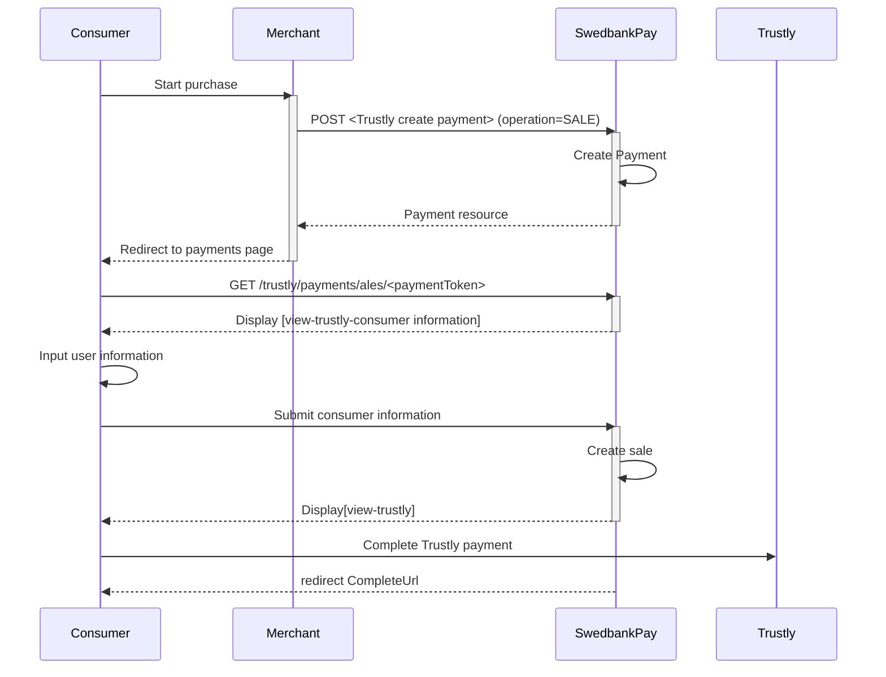





## Introduction

Redirect is the integration that lets Swedbank Pay handle the payments, while
you handle your core activities. When ready to pay, the consumer will be
redirected to a secure Swedbank Pay hosted site. Finally, the consumer will be
redirected back to your website after the payment process.

* When properly set up in your merchant/webshop site and the payer starts the
  purchase process, you need to make a `POST` request towards Swedbank Pay with
  your Purchase information. This will generate a payment object with a unique
  `paymentID`. You will receive a **redirect URL** to a Swedbank Pay payment
  page.
* You need to redirect the payer's Consumer to that specified URL so that the
  payer can enter the payment details in a secure Swedbank Pay environment.
* Swedbank Pay will redirect the payer's Consumer to - one of two specified URLs,
  depending on whether the payment session is followed through completely or
  cancelled beforehand.
* When you detect that the payer reach your `completeUrl` , you need to do a
  `GET` request to receive the state of the transaction, containing the
  `paymentID` generated in the first step, to receive the state of the
  transaction.

## Purchase

To create a Trustly payment, you perform an HTTP `POST` against the
`/psp/trustly/payments` resource.

An example of a payment creation request is provided below.
Each individual Property of the JSON document is described in the
following section.

{:.code-header}
**Response**

```http
POST /psp/trustly/payments HTTP/1.1
Host: {{ page.apiHost }}
Authorization: Bearer <AccessToken>
Content-Type: application/json

{
   "payment": {
       "operation": "Purchase",
       "intent": "Sale",
       "currency": "SEK",
       "prices": [
            {
               "type": "SwedbankPay",
               "amount": 1500,
               "vatAmount": 0
            }
        ],
       "description": "Test Purchase",
       "payerReference": "AB1234",
       "userAgent": "Mozilla/5.0...",
       "language": "sv-SE",
       "urls": {
           "completeUrl": "https://example.com/payment-completed",
           "cancelUrl": "https://example.com/payment-canceled",
           "callbackUrl": "https://example.com/payment-callback",
           "logoUrl": "https://example.com/logo.png",
           "termsOfServiceUrl": "https://example.com/terms.pdf"
        },
       "payeeInfo": {
           "payeeId": "{{ page.merchantId }}",
           "payeeReference": "PR123",
           "payeeName": "Merchant1",
           "productCategory": "PC1233",
           "orderReference": "or-12456",
           "subsite": "MySubsite"
        }
    }
}
```

{:.table .table-striped}
| Required | Property                     | Type         | Description                                                                                                                                                                                                                                               |
| :------: | :--------------------------- | :----------- | :-------------------------------------------------------------------------------------------------------------------------------------------------------------------------------------------------------------------------------------------------------- |
|  ✔︎︎︎︎︎  | `payment`                    | `object`     | The `payment` object contains information about the specific payment.                                                                                                                                                                                     |
|  ✔︎︎︎︎︎  | └➔&nbsp;`operation`          | `string`     | Purchase is the only type used for direct debit payments.                                                                                                                                                                                                 |
|  ✔︎︎︎︎︎  | └➔&nbsp;`intent`             | `string`     | Sale is the only type used for direct debit payments.                                                                                                                                                                                                     |
|  ✔︎︎︎︎︎  | └➔&nbsp;`currency`           | `string`     | The currency used.                                                                                                                                                                                                                                        |
|  ✔︎︎︎︎︎  | └➔&nbsp;`prices`             | `object`     | The `prices` resource lists the prices related to a specific payment.                                                                                                                                                                                     |
|  ✔︎︎︎︎︎  | └─➔&nbsp;`type`              | `string`     | Use the generic type `Directdebit` if you want to enable all bank types supported by merchant contract, otherwise specify a specific bank type. [See the Prices object types for more information.][technical-reference-price-object].                      |
|  ✔︎︎︎︎︎  | └─➔&nbsp;`amount`            | `integer`    | Amount is entered in the lowest momentary units of the selected currency. E.g. 10000 = 100.00 SEK 5000 = 50.00 SEK.                                                                                                                                       |
|  ✔︎︎︎︎︎  | └─➔&nbsp;`vatAmount`         | `integer`    | If the amount given includes VAT, this may be displayed for the user in the payment page (redirect only). Set to 0 (zero) if this is not relevant.                                                                                                        |
|  ✔︎︎︎︎   | └➔&nbsp;`description`        | `string(40)` | A textual description max 40 characters of the purchase.                                                                                                                                                                                                  |
|          | └➔&nbsp;`payerReference`     | `string`     | The reference to the payer (consumer/end-user) from the merchant system, like mobile number, customer number etc.                                                                                                                                         |
|  ✔︎︎︎︎   | └➔&nbsp;`userAgent`          | `string`     | The user agent reference of the consumer's Consumer - [see user agent definition][user-agent].                                                                                                                                                             |
|  ✔︎︎︎︎   | └➔&nbsp;`language`           | `string`     | `nb-NO`, `sv-SE` or `en-US`.                                                                                                                                                                                                                                    |
|  ✔︎︎︎︎︎  | └➔&nbsp;`urls`               | `object`     | The `urls` resource lists urls that redirects users to relevant sites.                                                                                                                                                                                    |
|  ✔︎︎︎︎   | └─➔&nbsp;`completeUrl`       | `string`     | The URI that Swedbank Pay will redirect back to when the payment is followed through. This does not indicate a successful payment, only that it has reached a completion state. A`GET`request needs to be performed on the payment to inspect it further. |
|  ✔︎︎︎︎   | └─➔&nbsp;`cancelUrl`         | `string`     | The URI that Swedbank Pay will redirect back to when the user presses the cancel button in the payment page.                                                                                                                                              |
|          | └─➔&nbsp;`callbackUrl`       | `string`     | The URI that Swedbank Pay will perform an HTTP POST against every time a transaction is created on the payment. See [callback][technical-reference-callbackurl] for details.                                                                              |
|          | └─➔&nbsp;`logoUrl`           | `string`     | The URI that will be used for showing the customer logo. Must be a picture with at most 50px height and 400px width. Require https.                                                                                                                       |
|          | └─➔&nbsp;`termsOfServiceUrl` | `string`     | A URI that contains your terms and conditions for the payment, to be linked on the payment page. Require https.                                                                                                                                           |
|  ✔︎︎︎︎︎  | └➔&nbsp;`payeeInfo`           | `object`     | The `payeeInfo` contains information about the payee.                                                                                                                                                                                                     |
|  ✔︎︎︎︎   | └─➔&nbsp;`payeeId`           | `string`     | This is the unique id that identifies this payee (like merchant) set by PayEx.                                                                                                                                                                            |
|  ✔︎︎︎︎   | └─➔&nbsp;`payeeReference`    | `string(35)` | A unique reference from the merchant system. It is set per operation to ensure an exactly-once delivery of a transactional operation. See [payeeReference][technical-reference-payeereference] for details.                                               |
|          | └─➔&nbsp;`payeeName`         | `string`     | The payee name (like merchant name) that will be displayed to consumer when redirected to PayEx.                                                                                                                                                          |
|          | └─➔&nbsp;`productCategory`   | `string`     | A product category or number sent in from the payee/merchant. This is not validated by PayEx, but will be passed through the payment process and may be used in the settlement process.                                                                   |
|          | └─➔&nbsp;`orderReference`    | `string(50)` | The order reference should reflect the order reference found in the merchant's systems.                                                                                                                                                                   |
|          | └─➔&nbsp;`subsite`           | `String(40)` | The subsite field can be used to perform split settlement on the payment. The subsites must be resolved with Swedbank Pay reconciliation before being used.                                                                                               |                                                                                 |

{:.code-header}
**Response**

```http
HTTP/1.1 200 OK
Content-Type: application/json

{
   "payment": {
       "id": "/psp/trustly/payments/{{ page.paymentId }}",
       "number": 1234567890,
       "instrument": "Trustly",
       "created": "2018-10-09T13:01:01Z",
       "updated": "2018-10-09T13:01:01Z",
       "state": "Ready",
       "operation": "Purchase",
       "intent": "Sale",
       "currency": "SEK",
       "amount": 1500,
       "remainingReversalAmount": 0,
       "description": "Test Purchase",
       "userAgent": "Mozilla/5.0...",
       "language": "sv-SE",
       "prices": { "id": "/psp/trustly/payments/{{ page.paymentId }}/prices" },
       "transactions": { "id": "/psp/trustly/payments/{{ page.paymentId }}/transactions" },
       "sales": { "id": "/psp/trustly/payments/{{ page.paymentId }}/sales" },
       "reversals": { "id": "/psp/trustly/payments/{{ page.paymentId }}/reversals" },
       "payeeInfo" : { "id": "/psp/trustly/payments/{{ page.paymentId }}/payeeInfo" },
       "urls" : { "id": "/psp/trustly/payments/{{ page.paymentId }}/urls" },
       "settings": { "id": "/psp/trustly/payments/{{ page.paymentId }}/settings" }
  },
   "operations": [
        {
           "href": "{{ page.apiUrl }}/psp/trustly/payments/{{ page.paymentId }}/sales",
           "rel": "redirect-sale",
           "method": "POST"
        },
        {
           "href": "{{ page.apiHost }}/psp/trustly/payments/{{ page.paymentId }}",
           "rel": "update-payment-abort",
           "method": "PATCH"
        }
    ]
}
```

### General



## Sales

The `Sales` resource lists the sales transactions (one or more) on a
specific payment.



{:.code-header}
**Response**

```http
HTTP/1.1 200 OK
Content-Type: application/json

{
   "payment": "/psp/trustly/payments/{{ page.paymentId }}",
   "sales": {
       "id": "/psp/trustly/payments/{{ page.paymentId }}/sales",
       "salesList": [
            {
               "id": "/psp/trustly/payments/{{ page.paymentId }}/sales/{{ page.transactionId }}",
               "selectedBank": "NordeaFI",
               "deviceIsMobile": true,
               "transaction": {
                   "id": "/psp/trustly/payments/{{ page.paymentId }}/transactions/{{ page.transactionId }}",
                   "created": "2018-09-14T01:01:01.01Z",
                   "updated": "2018-09-14T01:01:01.03Z",
                   "type": "Sale",
                   "state": "Initialized",
                   "number": 1234567890,
                   "amount": 1000,
                   "vatAmount": 250,
                   "description": "Test transaction",
                   "payeeReference": "AH123456",
                   "failedReason": "",
                   "failedActivityName": "",
                   "failedErrorCode": "",
                   "failedErrorDescription": "",
                   "isOperational": true,
                   "operations": [
                    ]
                }
            },
            {
               "id": "/psp/trustly/payments/{{ page.paymentId }}/sales/{{ page.transactionId }}",
               "selectedBank": "NordeaFI",
               "deviceIsMobile": true,
               "transaction": {
                   "id": "/psp/trustly/payments/{{ page.paymentId }}/transactions/{{ page.transactionId }}",
                   "created": "2018-09-14T01:01:01.01Z",
                   "updated": "2018-09-14T01:01:01.03Z",
                   "type": "Sale",
                   "state": "Initialized",
                   "number": 1234567890,
                   "amount": 1000,
                   "vatAmount": 250,
                   "description": "Test transaction",
                   "payeeReference": "AH123456",
                   "failedReason": "",
                   "failedActivityName": "",
                   "failedErrorCode": "",
                   "failedErrorDescription": "",
                   "isOperational": false,
                   "operations": [
                        {
                           "href": "{{ page.apiUrl }}/psp/trustly/payments/{{ page.paymentId }}",
                           "rel": "edit-sale",
                           "method": "PATCH"
                        }
                    ]
                }
            }
        ]
    }
}
```


